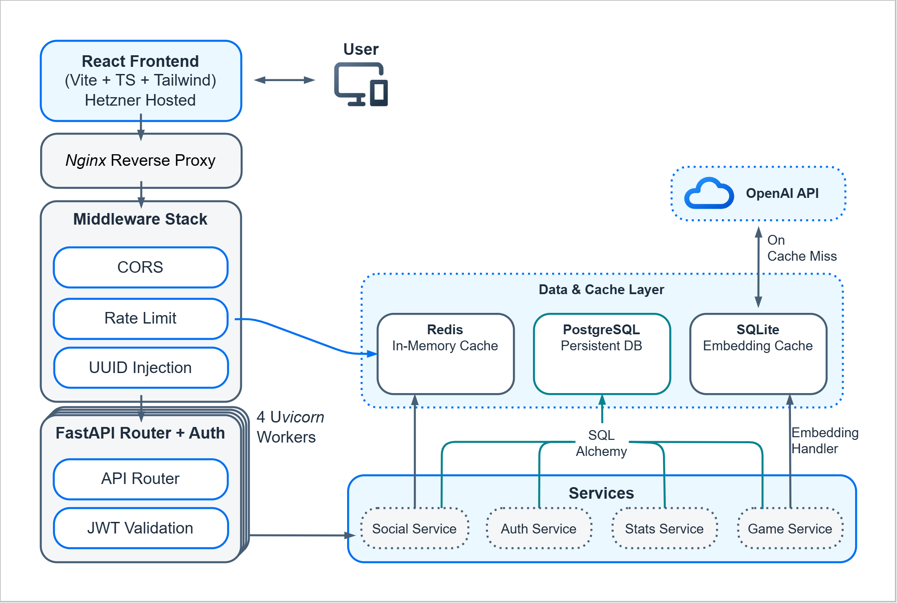
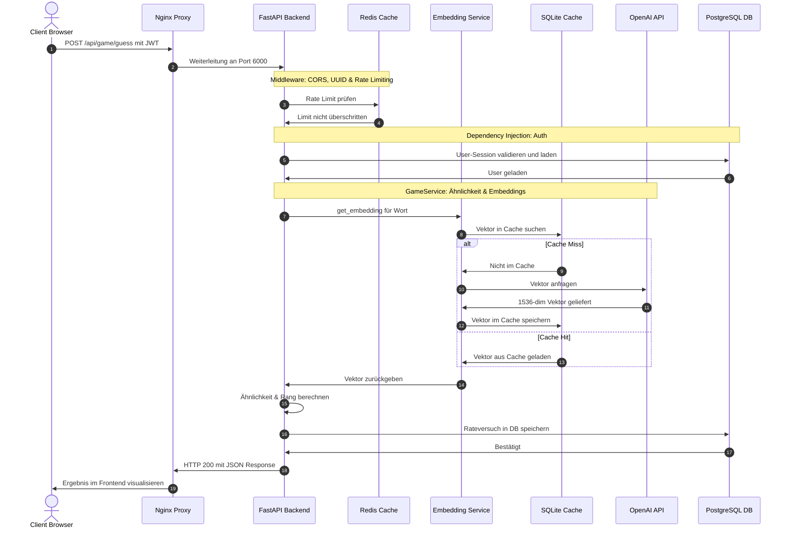
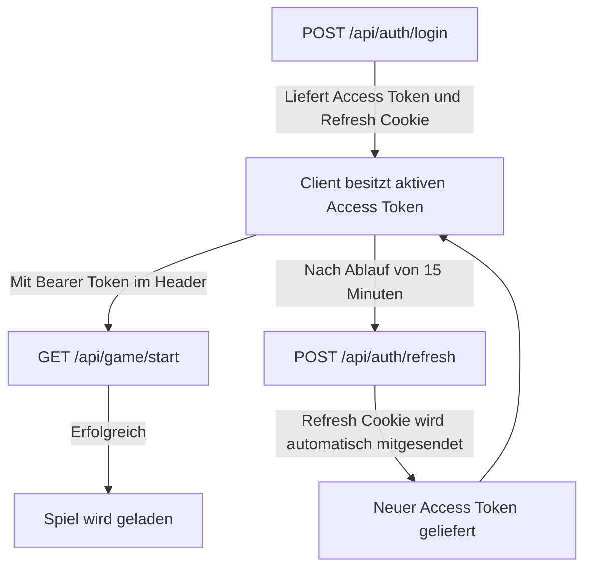
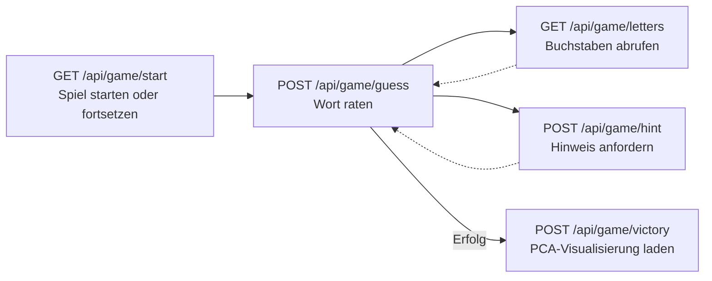

<h1 style="text-align: center;">Mobile Applikation Vector Valley</h1>

Projektarbeit im Modul *KI in mobilen Applikationen* an der Hochschule für angewandte Wissenschaften Ansbach.

**Live-Demo:** [leonhard-behr.de](https://leonhard-behr.de) | **API-Basis:** `https://api.leonhard-behr.de`


### Architektur



**Nginx** (aus [``nginx.conf``](frontend\nginx.conf)):
- API-Anfragen an Gunicorn auf Port 6000 weiterleiten
- Static files aus ``frontend/dist`` serve

**Middleware** (aus [``main.py``](backend\main.py)):
1. CORS: Origin-Validierung gegen Allowlist
2. Rate Limit: Redis Sliding Window (100 Anfragen pro 60 Sekunden je IP)
3. UUID Injection: ``X-Correlation-ID``-Header für das Request-Tracing

**Gunicorn** verwaltet 4 parallele Uvicorn-Worker-Prozesse. Da die Worker keinen gemeinsamen Speicher teilen, wird Redis als geteilter Cache verwendet (Rate Limiting und Leaderboard-Cache).

### Request-Ablauf



### Deployment

#### Frontend
Die React-SPA wird per Vite zu statischen Dateien gebuildet und direkt von Nginx served.
Nginx leitet `/api/*` per `proxy_pass` an Port 6000 weiter.

```shell
npm run build
```

#### Backend
Docker Compose verwaltet drei Container: FastAPI-Backend, PostgreSQL und Redis. Im Dockerfile ist das Ausführen des Shell Skripts [``entrypoint.sh``](backend\entrypoint.sh) als ENTRYPOINT konfiguriert. Das Skript wartet auf die Datenbankverbindung, führt die Datenbank-Migrationen für PostgreSQL via Alembic aus (SQLite wird bei App-Start automatisch initialisiert) und startet anschließend den Gunicorn-Server.

```shell
ssh root@178.104.137.28
docker-compose up -d
```

---

### REST API (via FastAPI)

Die API folgt dem REST-Prinzip (JSON-Format) und wird durch das **FastAPI-Framework** bereitgestellt. 
FastAPI organisiert die Logik in 4 dedizierten Routern (Auth, Game, Stats, Social) und validiert alle Daten automatisch über Pydantic. Alle Endpunkte sind unter dem Präfix `/api/` erreichbar.

#### API-Endpunkte & Router

| Modul | Route | Methode | Auth |
| :--- | :--- | :--- | :--- |
| **Auth** | `/api/auth/register` | `POST` | – |
| | `/api/auth/login` | `POST` | – |
| | `/api/auth/refresh` | `POST` | Cookie |
| | `/api/auth/me` | `GET` · `PATCH` | JWT |
| **Game** | `/api/game/start` | `GET` | JWT |
| | `/api/game/guess` | `POST` | JWT |
| | `/api/game/hint` | `POST` | JWT |
| | `/api/game/letters` | `GET` | JWT |
| | `/api/game/victory` | `POST` | JWT |
| | `/api/game/history` | `GET` | JWT |
| **Stats** | `/api/stats/profile` | `GET` | JWT |
| | `/api/stats/journey` | `GET` | JWT |
| | `/api/stats/achievements` | `GET` | JWT |
| **Social** | `/api/social/friends` | `GET` | JWT |
| | `/api/social/leaderboard/daily` | `GET` | JWT |
| | `/api/social/leaderboard/streak` | `GET` | JWT |
| **Health** | `/api/health` | `GET` | – |

#### Authentifizierung

Das System verwendet ein **Dual-Token-Verfahren** (aus [`security.py`](backend\app\core\security.py)):

| Token | Laufzeit | Übertragung | Zweck |
| :--- | :--- | :--- | :--- |
| Access Token | 15 Minuten | `Authorization: Bearer <token>` Header | API-Anfragen authentifizieren |
| Refresh Token | 7 Tage | HttpOnly Cookie (`path=/api/auth`) | Neuen Access Token ausstellen |

Der Access Token enthält ein `type`-Claim (`"access"` / `"refresh"`), um Missbrauch des Refresh Tokens als Access Token zu verhindern. Signiert mit HS256.

**Authentifizierungsablauf:**




#### Request/Response-Format

Alle Anfragen und Antworten verwenden `application/json`. Pydantic v2 validiert Eingaben serverseitig. Fehler geben standardisierte HTTP-Statuscodes zurück:

| Code | Bedeutung |
| :--- | :--- |
| `200` | Erfolg |
| `401` | Kein oder ungültiger JWT |
| `403` | Zugriff verweigert |
| `404` | Ressource nicht gefunden |
| `409` | Konflikt (z.B. Benutzername bereits vergeben) |
| `422` | Validierungsfehler (Pydantic) |
| `429` | Rate Limit überschritten (100 Req/60 s je IP) |
| `503` | Redis nicht erreichbar |

**Beispiel:** `POST /api/game/guess`
```json
// request
{ "word": "sonne" }

// response
{
  "word": "sonne",
  "similarity": 72.4,
  "rank": 142,
  "is_correct": false
}
```

#### Spielablauf über die API




---

### Architecture Decisions

#### Warum drei verschiedene Datenbanken?

Jede Datenbank übernimmt eine Aufgabe, für die sie optimiert ist:

**PostgreSQL**: relationale Persistenz
Benutzerdaten, Spielsessions, Rateversuche und Freundschaften sind relational. Persistenz, Konsistenz, Integrität sind hier der Fokus.

**Redis**: geteilter, flüchtiger Zustand zwischen Prozessen
Gunicorn startet 4 unabhängige Uvicorn-Worker-Prozesse. Da die Prozesse keinen gemeinsamen Arbeitsspeicher teilen, kann das Rate-Limiting nicht lokal verwaltet werden. Redis löst das als geteilter In-Memory-Speicher (austausch zwischen den workern). Zusätzlich werden Leaderboard Daten gecacht, um die Datenbanklast bei häufigen Anfragen zu reduzieren.

**SQLite**: persistenter Disk Cache für Embedding Vektoren
Rateversuche werden in Embeddings umgewandelt. Da jeder Rateversuch ein 1536-dimensionales Embedding-Vektor ergibt, speichert SQLite diese Vektoren dauerhaft auf Disk, sodass ein Wort, das einmal eingebettet wurde, nie wieder die API aufrufen muss (schneller und kostengünstiger).


#### Warum Docker Compose statt direkter Ubuntu-Installation?

Eine direkte PostgreSQL oder Redis Installation auf Ubuntu wäre schneller aufgesetzt, hat aber Nachteile. Docker Compose ist robuster und flexibler:

- **Isolation:** Jeder Container hat seine eigene Laufzeitumgebung. Python-Abhängigkeiten des Backends interferieren nicht mit dem System.
- **Reproduzierbarkeit:** Docker Compose startet exakt dieselbe Umgebung auf jedem Server, unabhängig von der Umgebung.
- **Startup-Reihenfolge:** Docker Compose verwaltet die Abhängigkeitskette mit `depends_on` und `healthcheck`. Das Backend startet erst, wenn PostgreSQL und Redis als aktiv sind.


#### Warum Alembic für Datenbankmigrationen?

Ohne ein Migrationssystem muss das Datenbankschema manuell per SQL-Skript gepflegt werden. Alembic erzeugt versionierte Migrationsdateien, die in der Versionskontrolle liegen. So lässt sich das Schema reproduzierbar auf jeden Zielserver anwenden: `alembic upgrade head` bringt die FB immer auf den aktuellen Stand, ohne dass manuelle SQL Befehle nötig sind.

SQLite benötigt keine Migrationen, da es ausschließlich als Cache dient und die Tabelle bei jedem Start via `CREATE TABLE IF NOT EXISTS` (aus ``embedding.py``) angelegt wird.


#### Warum FastAPI (async) statt Flask oder Django?

Das Spiel führt bei jedem Rateversuch eine externe API-Anfrage (zu OpenAI) durch. In einem synchronen Framework wie z.B.Flask würde der Worker-Thread während dieser HTTP-Anfrage blockieren und keine anderen Anfragen bedienen können. 

FastAPI ist asynchron und kann parallel mehrere Anfragen bearbeiten. Zusätzlich liefert FastAPI automatische Validierung via Pydantic und eine OpenAPI-Dokumentation ohne zusätzlichen Aufwand.


#### Warum Gunicorn mit 4 Uvicorn-Workern?

FastAPI/Uvicorn ist single-threaded pro Worker-Prozess. Mehrere Worker erhöhen den Durchsatz für CPU Operationen (z.B. PCA-Berechnungen für die Victory Map, Kosinus-Ähnlichkeit über 800 Wörter etc.) und erhöhen die Robustheit.


#### Warum JWT statt Sessions?

Die Applikation ist zustandslos auf Server-Seite, es ist kein Session-Speicher nötig. JWT-Tokens tragen alle nötigen Informationen (User-ID, Ablaufzeit, Token-Typ) selbst. Eine Anfrage kann auf jeden der 4 Worker landen, ohne dass dieser den Session-Zustand kennen muss.


#### Warum Nginx als Reverse Proxy?

Nginx übernimmt TLS-Terminierung, Gzip-Komprimierung und das Ausliefern statischer Dateien direkt aus dem Dateisystem. Zusätzlich entkoppelt Nginx den Deployment-Prozess: Das Frontend kann unabhängig vom Backend neu gebaut und deployt werden.


### Anforderungen & Wertschöpfung

#### Funktionale Anforderungen

- **Registrierung & Authentifizierung:** Registrierung, Login, Profilverwaltung und Dual-Token-Sicherungsverfahren (JWT + HttpOnly Cookie).

- **Spielmodi:** Tägliche Herausforderung (einheitliches Wort pro Tag) sowie freier Spielmodus (freier Spielmodus wird aktuell im Frontend nicht angezeigt).

- **Sofortiges Feedback:** Vergleiche durch semantischer Nähe und Ranks.

- **Hinweise:** Schrittweise Buchstabeneaufdeckung (jeweils nach 3 Versuchen) sowie maximal 3 (adaptive) Hinweise pro Spiel.

- **"Semantic Journey" Visualisierung:** Grafische Darstellung des semantischen Verlaufs nach erfolgreichem Spielabschluss.

- **Soziale Interaktion:** Freundschafts-System, Aktivitätsfeed und Bestenlisten (Tages-Score & Streak-Bestenliste).


#### Nicht-Funktionale Anforderungen (NFA)

- **Sicherheit:** Schutz gegen Brute-Force/DoS durch Rate Limiting (Middleware im Backend, Nginx im Reverse-Proxy). Sichere Speicherung von Passwörtern (bcrypt) und Schutz vor Session-Hijacking (Secure/HttpOnly Cookies).

- **Latenz & Kostenkontrolle:** Minimierung der API-Antwortzeiten sowie Vermeidung unnötiger API-Kosten durch lokales Caching.

- **Skalierbarkeit & Isolation:** Asynchrone Bearbeitung von Anfragen im Backend; einfaches Deployment via Docker.


#### KI-Wertschöpfung

Das Finden von Wörtern durch semantische Ähnlichkeit anstelle von reinem Buchstabenabgleich ist die Kernidee des Spiels. Verwendet werden Embeddings zum Vergleich von Wörtern:

1. **Embeddings:** Jedes geratene Wort wird über die OpenAI API (`text-embedding-3-small`) in einen 1536-dimensionalen Vektor übersetzt.

2. **Cosine Similarity:** Über die Cosine Similarity zum Zielvektor wird berechnet, wie nah der Versuch dem Lösungswort ist. 

3. **Reduktion & Darstellung:** Nach dem richtigen Raten des Zielworts berechnet das Backend mittels PCA eine 2D darstellung der 1536D Embeddings. 

4. **Caching (SQLite):** Um Token Kosten zu minimieren und Antwortzeiten bei wiederholten Wörtern zu senken, puffert SQLite die Embeddings dauerhaft auf Disk.


### Tests

Das Projekt verfügt über eine automatische Tests (``pytest`` + ``httpx``), die lokal (dev) als auch nach dem Deployment ausgeführt werden können (prod). Die Tests decken alle Kernfunktionen (Auth, Guess, Social) und kritische Edge Cases (double registrations, invalid guesses, limit violations) ab.

#### Testausführung

Die Ziel-URL der zu testenden API kann über die Umgebungsvariable ``TEST_BASE_URL`` gesteuert werden (Standardwert ist ``http://localhost:6000``).

**Ausführung während dev:**
```shell
cd backend
pip install pytest pytest-asyncio
export TEST_BASE_URL="http://localhost:6000"
python run_tests.py
```

**Ausführung während prod:**
```shell
export TEST_BASE_URL="https://api.leonhard-behr.de"
python run_tests.py
```

